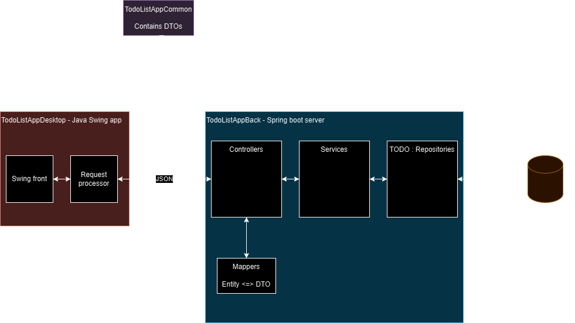
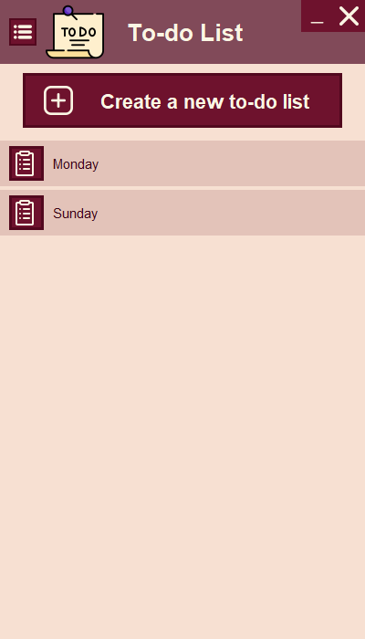
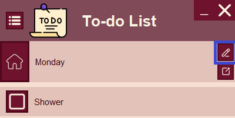
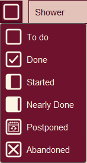
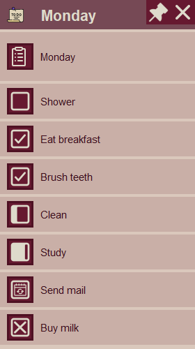
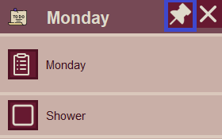
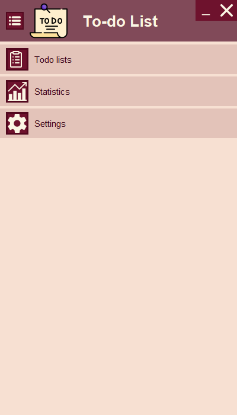

# Todo-List App

Welcome on the todo-list App readme! 

## Table of content

* [General presentation](#general-presentation)
    - [Todo-list tab](#todo-list-tab)
    - [The menu tab](#the-menu-tab)
* [Roadmap](#roadmap)
    - [Features](#features)
    - [Technical](#technical)

## General presentation

This application allows you to create todo-lists and to manage them. 

Here is the architecture of the app:

### Todo-list tab

In the todo-list tab, you can create todo-lists and save them.

You can open your todo-list by clicking the one you want. To update the tasks (add or change the content) of your todo,
you need to click on the edit button.

However, if you only want to update the status (todo, done, started, nearly done, postponed, abandoned) of your task,
you can do it without clicking the edit.

If you want your todo list in a smaller frame, you can open it using the button right under the edit button.

If you want to pin it, so that it stays on top of all your application you can use the pin button at the top of the
pop-up frame.

In the pop-up frame, you will be able to update the status of your tasks, but not edit the todo-list in itself.

### The menu tab

You can access the menu tab by clicking the menu button at the left of the application logo. In this tab, you will be
able to access the settings tab and the statistics tab (feature to come).

## Roadmap

### Features

- [ ] Implement timed todo-list to be able to reset todo-lists every day/week/month etc.
- [ ] Create statistics based on certain types of todo-lists. For example, how many times did you eat breakfast on your
  every day todo-list
- [ ] Add an option to disable statistics if you don't want them.
- [ ] A search bar to look for a todo-list

### Technical

- [ ] Implement a way to log in the app.
- [ ] Handle translation.
- [ ] Android app.
- [ ] Browser app.